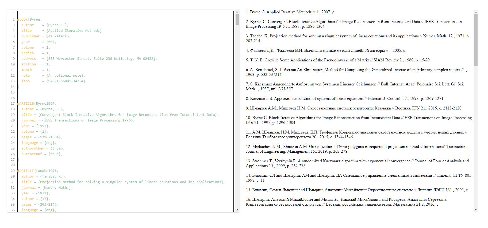

#BibTex2Word

This a program which transform the `bibtex` references to `word` references.

**Feel free for commiting to make it better**

The input format 
```tex
@article{shmyrin2016note,
	title={A Note on Heuristic Analog of Cline’s Formula},
	author={Shmyrin, A.M. and Mishachev, N. M. and Trofimov, E.P.},
	journal={Global Journal of Pure and Applied Mathematics},
	volume={12},
	number={4},
	pages={3401--3405},
	year={2016}
}
```
will transform to 
```text
1. Shmyrin A. M., Mishachev N. M., Trofimov E. P. (2018) Neighborhood systems priority identification and " +
        "randomized Kaczmarz algorithm. Int. Russian Automation Conf. (RusAutoCon) (Sochi Russia), pp 1-4
```

Example:

